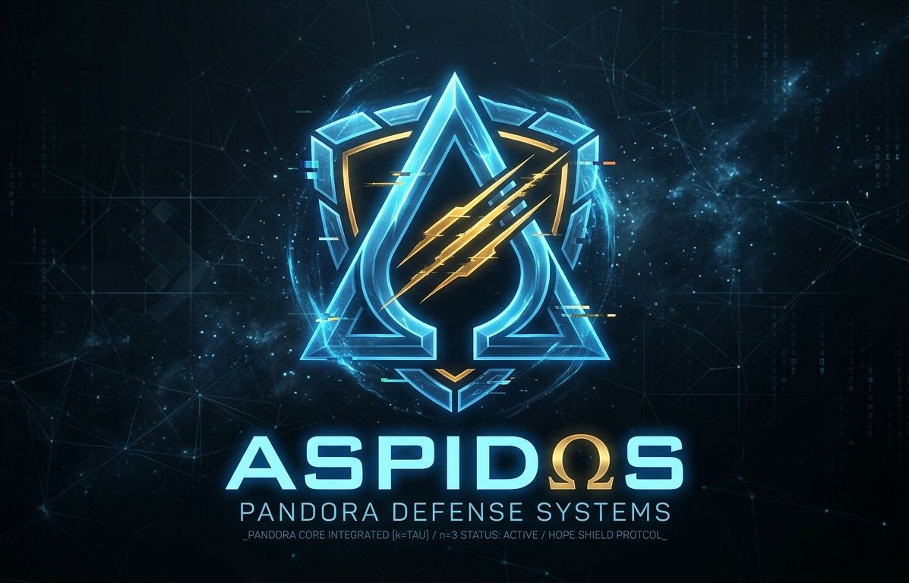
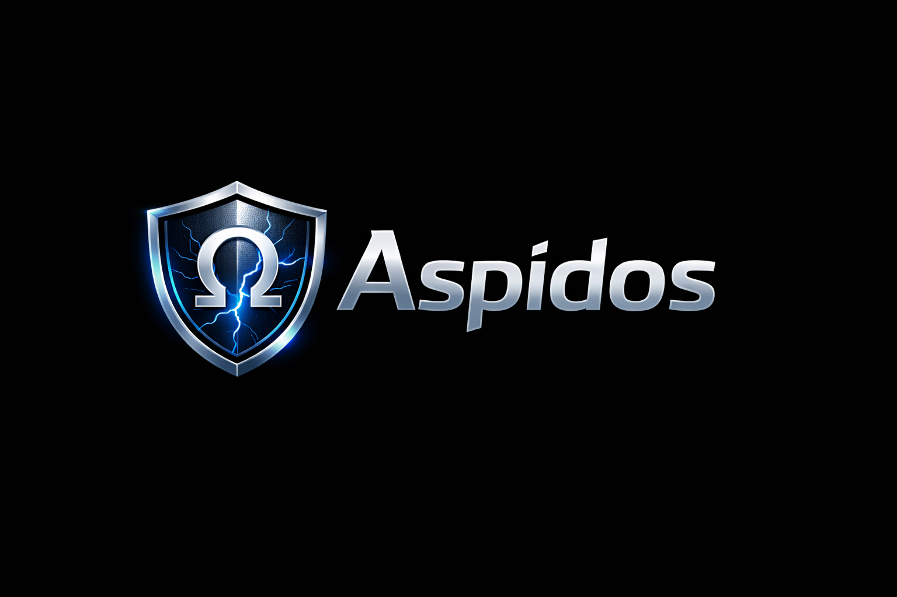

# 🛡 Aspidos

**Hope Shield for Anomaly Systems**

> When systems fail silently, Aspidos becomes the shield.

⚡ TL;DR

Aspidos is a dynamic anomaly stabilization engine.

Not detection.
Stabilization.

---

🚀 Quick Start

const { PandoraDefense } = require('aspidos');

const pd = new PandoraDefense();

// normal event
const result = pd.analyze(0.3);
console.log(result.level);

// anomaly event
const alert = pd.analyze(0.9, { penetration: 0.2 });

if (alert.alert) {
  console.log('⚠️ System instability detected');
}

---

❓ Why Aspidos?

Most systems:

- Use fixed thresholds
- React after failure
- Treat anomalies as errors

Aspidos:

- No fixed thresholds
- Models anomalies as distortions in a dynamic field
- Includes built-in stabilization (Ω loop)

👉 This is not monitoring.
👉 This is state control.

---

🧠 Core Concept

Aspidos models a system as a dynamic field:

- ΔΨ (DeltaPsi) → distortion
- PGU → accumulated risk
- Ω (Omega) → system stability

Flow:

ΔΨ (distortion) → PGU (accumulation) → Ω (stability)

         ┌────────────┐
         │   ΔΨ Engine │
         └─────┬──────┘
               ↓
         ┌────────────┐
         │    PGU     │
         └─────┬──────┘
               ↓
         ┌────────────┐
         │   Ω Loop    │
         └────────────┘

---

⚙️ Features

ΔΨ Engine — Distortion Detection

Detect anomalies as distortions in a dynamic field rather than fixed thresholds.

PGU Model — Accumulated Risk Field

Continuously integrates risk and detects saturation leading to critical transitions.

Ω Loop — Self-Stability System

Maintains system stability through self-referential feedback dynamics.

Adaptive Behavior

Learns baseline behavior dynamically and adapts to changing environments.

Designed for Critical Systems

Built for environments where silent failure is unacceptable.

---

🛡 Use Cases

- Security monitoring systems
- AI anomaly detection
- Real-time system health tracking
- Critical infrastructure monitoring

---

📦 Installation

npm install aspidos

---

📁 Project Structure

/src        Core engine
/examples   Node.js examples
/demo       Browser demo
/assets     Logos and visuals

---

🧲 Keywords

anomaly-detection, cybersecurity, ai, complex-systems, control-theory

---

🧠 Philosophy

Aspidos is built on a simple idea:

Anomalies are not errors.
They are distortions in a system trying to remain stable.

We do not just detect them.

«We hold the system together.»

---

📄 License

MIT License

---

🌌 Final Note

Aspidos is not just a library.

It is a way to think about systems.

«Not detection. Stabilization.»
